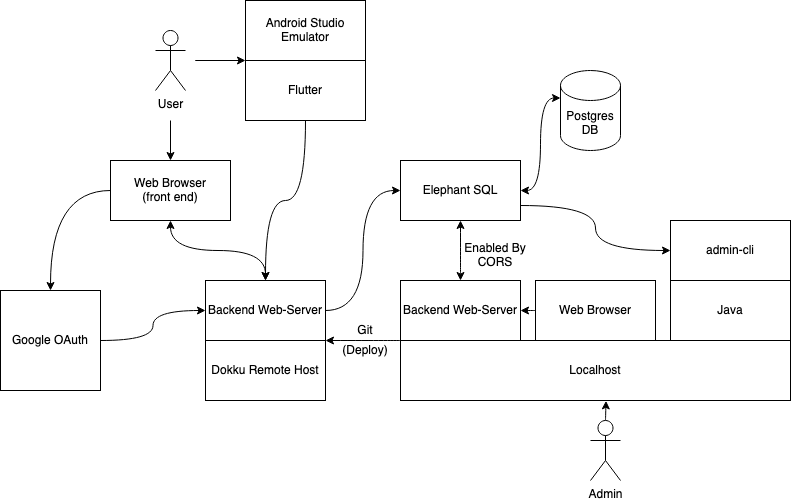
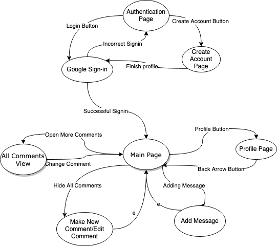
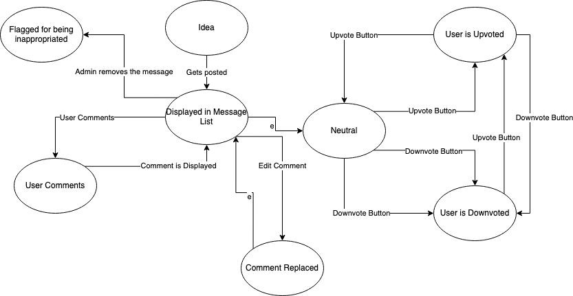
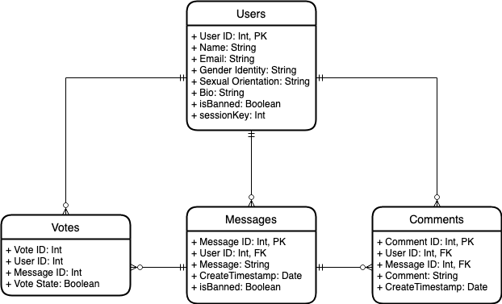

# The Buzz: Phase 2

## User Stories

### Admin Persona

- As an admin, I want to create a messages table so I can manage employee messages -- test (manual): when I run the create command to an empty database, it should create the message, users, votes, and comments tables
- As an admin, I want to invalidate an idea so it is not displayed -- test (manual): when I run an invalidate message command to the database for a specific message ID, that message should be marked as invalid in the table.
- As an admin, I want to invalidate a user from the users table so I can prevent them from logging in – test (manual): when I run an invalidate user command to the database, that user can no longer log in
- As an admin, I want to delete a messages table so I can clear all past messages -- test (manual): when I run delete table command to the database, all tables should be removed/cleared. 

### Authenticated User Persona

- As an employee, I want to be able to sign in with Google to verify my identity within the company – test (manual): when I sign in with my company domain email, I am either guided to create a profile or signed in to my profile
- As a verified employee, I want to post a message so I can share an idea with my coworkers – test (manual): when I type in a message and press post, it should appear in the message table
- As a verified employee, I want to upvote a coworker's message so I can show that I like their idea – test (manual): when I click the upvote on a message, the number of upvotes increase by 1
- As a verified employee, I want to downvote a like from a coworker's message so I can show that I disagree with their idea -- test (manual): when I click the downvote on a message, the number of downvotes increase by 1
- As a verified employee, I want to comment on a coworker’s message to share my thoughts about it -- test (manual): when I comment on a message, my comment appears below it
- As a verified employee, I want to update my profile information so I can show my accurate personal information -- test (manual): when I edit my profile information and submit, the changes are shown on my profile

## System Architecture Drawing



## Mock Web/Mobile UI

https://docs.google.com/presentation/d/1jGzrN1EtVlkEJ4EJLBePWA8qm0lTWS9oHJnZ7ALrbUc/edit?usp=sharing

## FSM for Anonymous User Interaction with App

### FSM for user personas interaction with the app



### FSM from the perspective of an idea



## Routes

```{markdown}

User = {
  str: name
  str: email
  str: gender_identity
  str: sexual_identity
  str: bio
}

Comment = {
  str: cContent
  int: cId
}

Message = {
  str: mContent
  int: mLikes
  int: mId
  dateStr: creationDate
  List<Comment>: mComments
}

POST to authenticate and get the session id
/session_authenticate  
send -> json {int: token_id}
receieve -> json {int: session_token}  

GET to retrieve all messages  
/messages?sess_token=000
receieve -> json {str: status, List\<Message> data}  

GET to retrieve a single message  
/messages/:id?sess_token=000
receive -> json {str: status, Message: data}  

POST for adding a message  
/messages  
send -> json {str: message, int: session_token}  
receive -> json {str: status, int: id}  

PUT for updating a message  
/messages/:id  
send -> json {int: id, str: message, int: session_token}  
receive ->  json {str: status, str: old_message}  

DELETE for removing a message  
/messages/:id  
send -> json {int: id, int: session_token}  
receive ->  json {str: status}  

PUT for liking a message  
/messages/l/:id
send -> json {int: id, int: session_token}
receive ->  json {str: status, int: newLikeCount, int userLikeState}  

PUT for disliking a message  
/messages/d/:id
send -> json {int: id, int: session_token}  
receive ->  json {str: status, int: newLikeCount, int: userLikeState}  

POST for adding a comment
/comment
send -> json {int: message_id, int: session_token, str: comment}
receive -> json {str: status, int: comment_id}  

PUT for editing a comment
/comment
send -> json {int: message_id, int: comment_id, int: session_token, str: comment}
receive -> json {str: status}  

DELETE for removing a comment
/comment
send -> json {int: message_id, int: comment_id, int: session_token}
receive -> json {str: status}  

GET for getting another user's profile  
/profile/:id  
send -> json {int: user_id, int: session_token}  
receive -> json {str: status, User: user}  

PUT for updating your own profile  
/profile/:id  
send -> json {int: user_id, int: session_token, User: user_new}  
receive -> json {str: status}  

```

## ERD for Database



## Listing of Tests

Backend:

* **test/java/edu/lehigh/cse216/cag224/backend**
  *AppTest.java*: Testing from the database connection
  *DataRowTest.java*: Testing for the DataRow class (representing a message)
  *DatabaseTest.java*: Testing for the database sql statemenets
  *RouteTest.java*: A specialized testing class for running each of the routes and checking their output. Will be run on a temporary table with garbage data.

The routes being tested are:

* Deliverable: Authentication
POST to authenticate and get the session id

* Deliverable: Messages
GET to retrieve all messages  
GET to retrieve a single message  
POST for adding a message  
PUT for updating a message  
DELETE for removing a message  

* Deliverable: Liking
PUT for liking a message  
PUT for disliking a message  
  
* Deliverable: Comments
POST for adding a comment
PUT for editing a comment
DELETE for removing a comment

* Deliverable: Profiles
GET for getting another user's profile  
PUT for updating your own profile

Admin:

- AppTest.java: Testing admin functions
- Implemented:
    - test connection to database upon run
- To be implemented:
    - messages, users, votes, and comments tables are created in the DB on create tables command
    - message is marked as banned in the DB on invalidate message by id command 
    - user is marked as banned in the DB on invalidate user by id command
    - all tables are deleted from the DB on delete tables command
    - a message is inserted in the messages table of the DB on the insert message command
    - all messages are fetched from the DB on the get messages command
    - an upvote is added from a user in the DB on the upvote command
    - a downvote is added from a user in the DB on the downvote command

Web:

- apptest.ts: A jasmine based web testing file
- To be implemented
  - User can view their own profile, and other user profiles
  - User can succesfully edit their profile information
  - User can click on add comment and the comment form appears
  - View more button on messages shows all comments when clicked
  - View less button hides all of the comments under the message
  - Edit button on comments works by popping up the comment form again
  - Delete button deletes the element it is connected to. 

Mobile:

- ***backend***
  - **backend_test.dart**: A testing class that will query all the fake routes from the mock backend
  - **mock_backend.dart**: A class that matches with the real backend to allow for testing without querying the live database
   - tests for above files: delete message, get all messages, get message by id, post message, update message
   - unimplemented for mock_backend, implemented for backend_test
  - **message_class_test.dart**: A test for the message class constructors
   - testing that messages are constructed with proper inputted info  
- ***views***
  - **page_test.dart**: A test for the HomeView widget
    - testing list of all messages view and that it loads data
  - Login/Logout: A test to check whether or not the user has logged in / or out of the server.
  - Upvote/downvote testing
  - Test to check if comments are displaying (but cannot be posted):


## Backlog Items/Technical Debt
- Switch web font from comic sans
- Get frontends to connect to dokku now that https is activated
- Copy web folder into backend-dokku branch to access web front-end on domain
